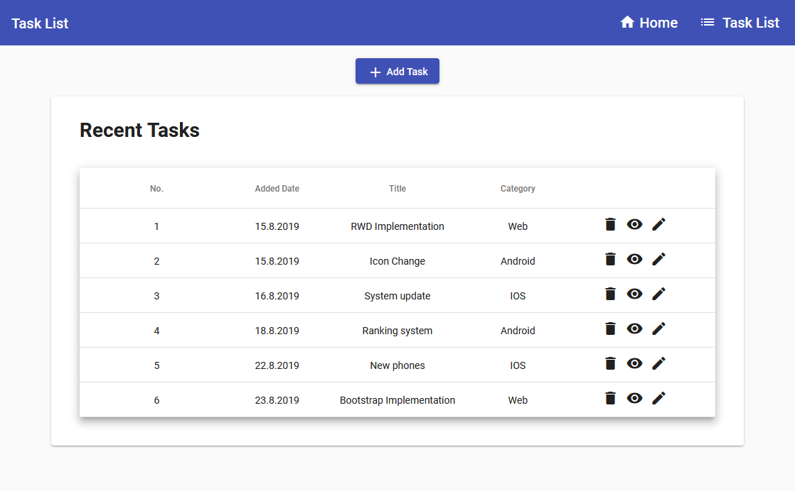

<p align="center">
    
</p>

## Table of contents
* [General info](#general-info)
* [Code organization](#code-organization)
* [Acknowledgements](#acknowledgements)
* [Setup](#setup)

## General info
This Angular project is an App for Project Managers to manage task list with use of [Angular Material](https://material.angular.io).

At this moment it contains following features:
* Home page
* Task List
* Adding a Task
* View details of a Task
* Removing task
* Edit task *(soon)*

## Code organization
    .
    ├── data                      # Data service
    ├── task-details              # Component responsible for representing a Single Task details
    ├── task-dialog               # Component responsible for representing a Dialog to add new Task
    ├── task-list                 # Component responsible for representing a Task List
    ├── welcome                   # Component responsible for representing Welcome Page
    ├── material.module.ts        # Module to centralize all Angular Materials
    └── Task.ts                   # Interface to represent instances of task list

## Acknowledgements
* [HAMMER.JS](https://hammerjs.github.io)
* [Angular Material](https://material.angular.io)
* [Material Icons](https://material.io/resources/icons)
    
## Setup
To run project:
```
npm i
npm start
```